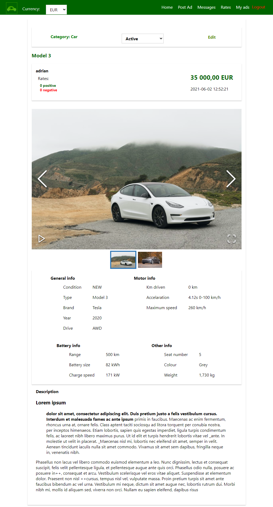
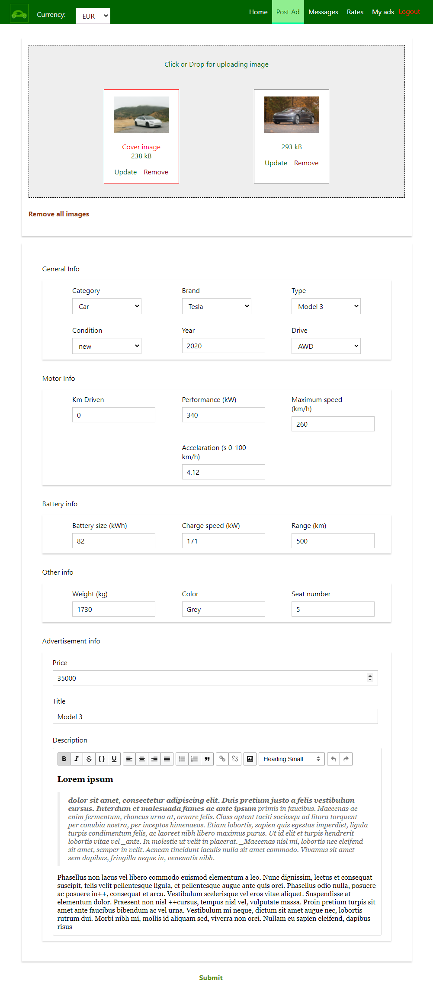
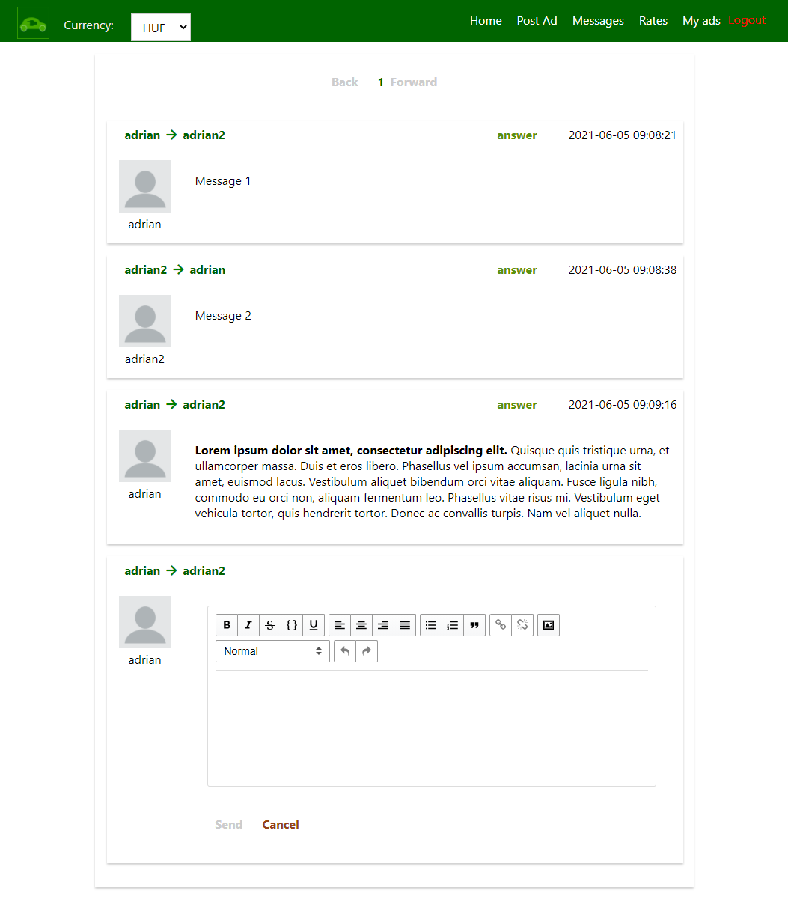
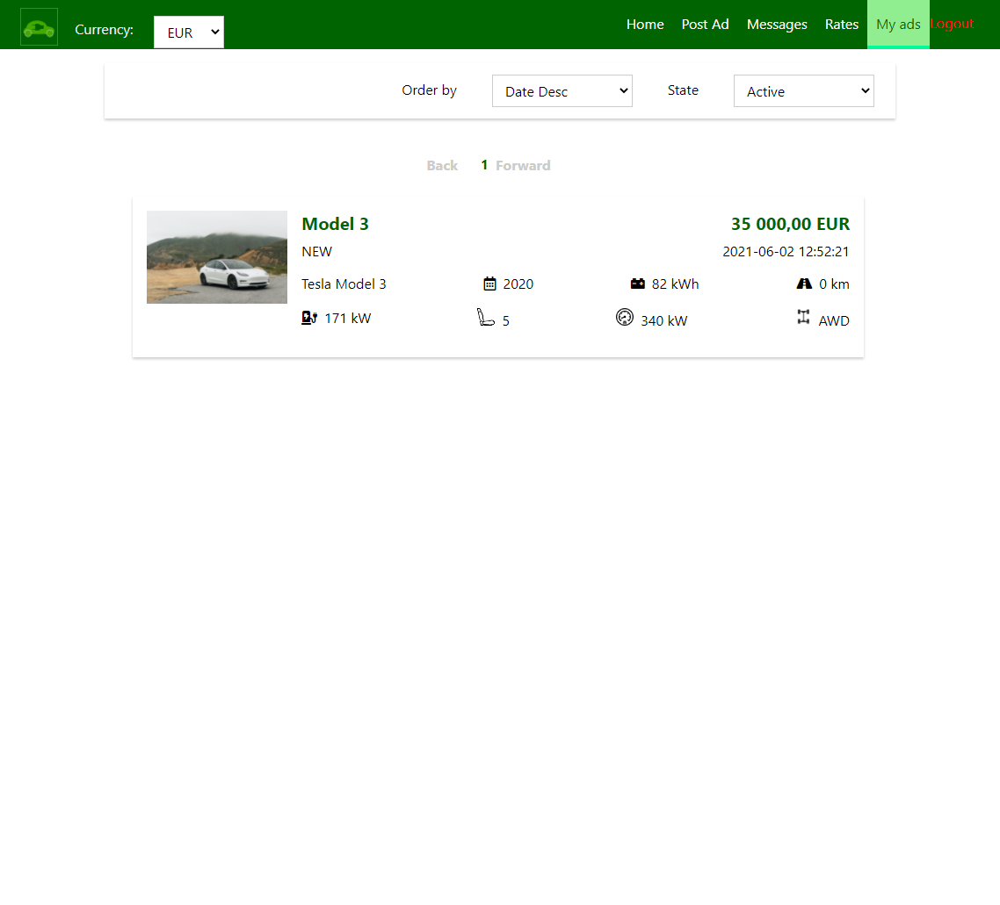
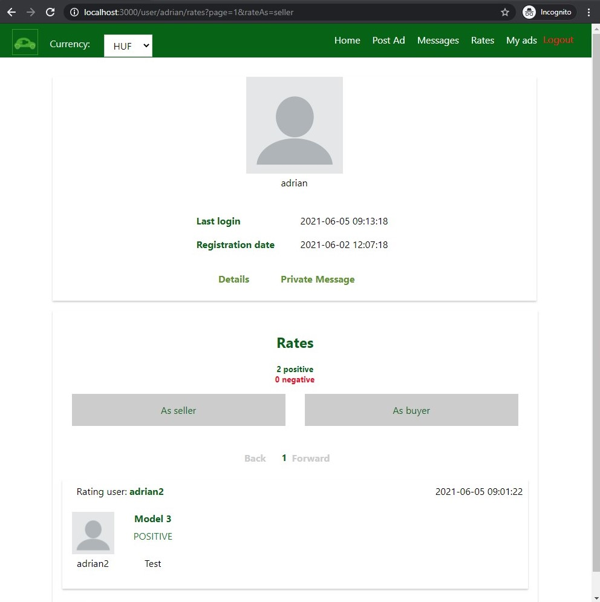
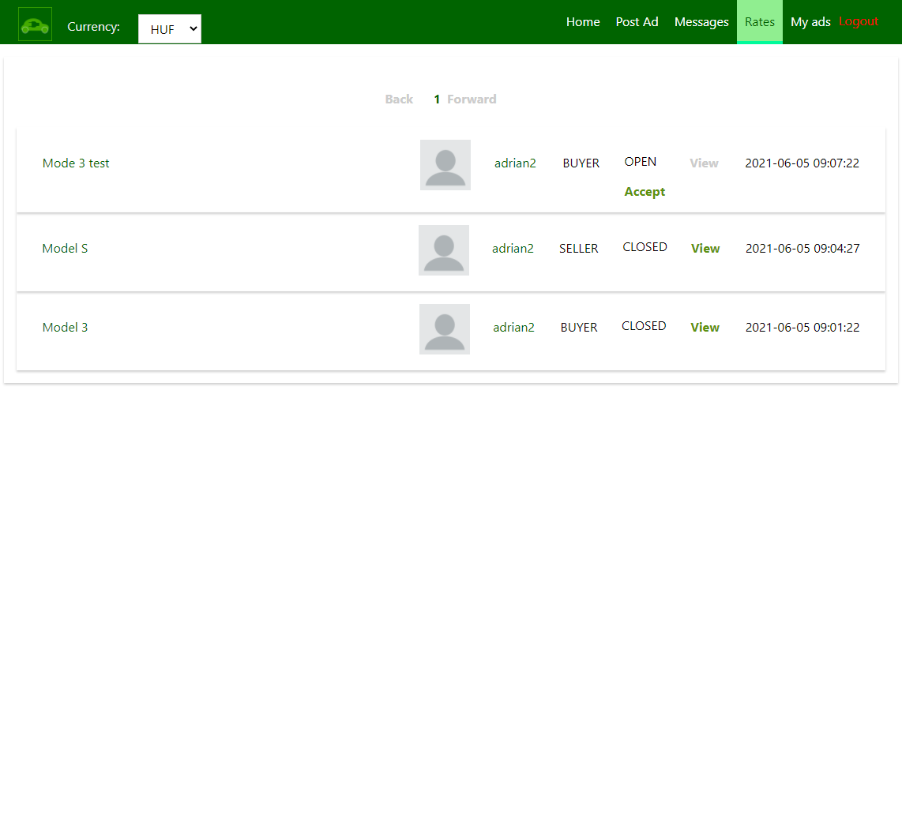

# eVehicle advertising webapp
- Built with React JS
- Used Rest Api: [Backend](https://github.com/p-adrian05/eVehicle-advertising-service)
## Commands:
- npm install
- npm run start

## With docker
- docker compose build
- docker compose up

- http://localhost:3000/advertisements

